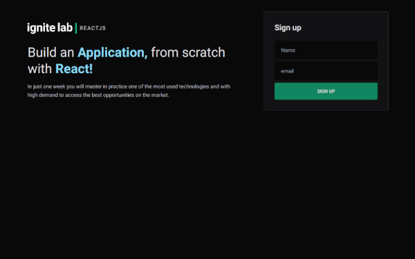

# Rocketseat - Ignite Lab page solution

This is a Project by Rocketseat [Iginite Lab](https://www.rocketseat.com.br).  

## Table of contents

- [Overview](#overview)
  - [Screenshot](#screenshot)
  - [Links](#links)
  - [Built with](#built-with)
  - [What I learned](#what-i-learned)
  - [Continued development](#continued-development)
- [Author](#author)

## Overview
  Application with features where you can sign up for the page with your email and access the page content for an Event where you can choose classes. 

### The challenge

Users should be able to:

- View the optimal layout for the site depending on their device's screen size.
- See hover states for all interactive elements on the page.
- Post comments and also delete them.

### Screenshot

 

### Links

- Source code: [https://github.com/LuciMacedo/Ignite-lab]
- Live Site URL: [Add live site URL here](https://ignite-hc52lpomn-lucimacedo.vercel.app/)

### Built with

- Semantic HTML5 markup
- CSS custom properties
- Flexbox
- CSS Grid
- React - JS library
- TailWind - For styles

### What I learned

While working through this project I learned more about states in React, tailwind, and async function.

### Continued development

Areas that I want to continue focusing on in future projects are GraphQl and Tailwind. I am still not completely comfortable with these techniques and I found them useful and want to refine them.

## Author

- Website - [Luci](https://luci-webpage.vercel.app/)
- Rocketseat - [Rocketseat](https://www.rocketseat.com.br)
- LinkedIn - [@lucimacedo](linkedin.com/in/lucimaramacedom)

